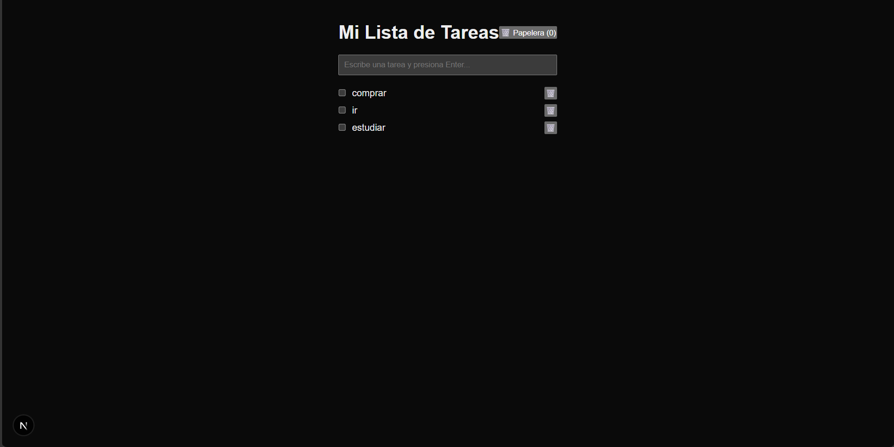
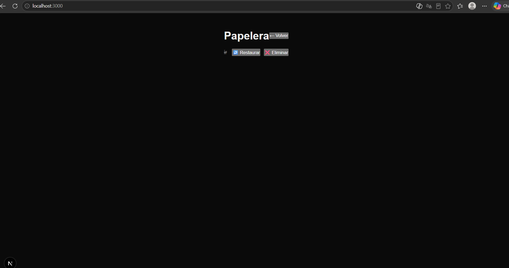

# Todo App

Aplicación de lista de tareas (To-Do List) desarrollada como proyecto de la asignatura de Desarrollo de Software, usando Next.js, React y TypeScript.

## Descripción

Permite crear, visualizar, completar, editar y eliminar tareas. Las tareas eliminadas no se pierden: se guardan en una Papelera desde donde se pueden restaurar o eliminar definitivamente.

## Tecnologías utilizadas

- [Next.js](https://nextjs.org) (App Router)
- [React](https://react.dev)
- [TypeScript](https://www.typescriptlang.org)

## Instalación

```bash
npm install
```

## Ejecución

```bash
npm run dev
```

Abre [http://localhost:3000](http://localhost:3000) en tu navegador.

## Funcionalidades

- **Crear tarea:** escribe el texto y presiona `Enter` (no requiere botón).
- **Visualizar tareas:** se listan automáticamente debajo del campo de texto.
- **Completar tarea:** un checkbox marca la tarea como hecha, tachando el texto sin eliminarla.
- **Editar tarea:** haz clic directamente sobre el texto de la tarea; el cambio se guarda automáticamente al salir del campo.
- **Eliminar tarea:** mueve la tarea a la Papelera (no se borra de inmediato).
- **Papelera:** desde el botón "🗑️ Papelera" se accede a la vista de tareas eliminadas.
  - **Restaurar:** regresa una tarea de la Papelera a la lista activa.
  - **Eliminar definitivamente:** borra la tarea de la Papelera para siempre.

## Papelera

Cuando el usuario elimina una tarea, en lugar de perderla, se mueve a una segunda lista (la Papelera). Desde ahí se puede restaurar la tarea a la lista principal o eliminarla definitivamente. La idea está inspirada en la papelera de la app Fotos del iPhone: un botón de acceso muestra cuántos elementos hay en ella, y desde esa vista se puede recuperar o borrar cada elemento de forma permanente.

## Integrantes

- Dylan Fuentes

## Capturas

### Lista de tareas


### Papelera
